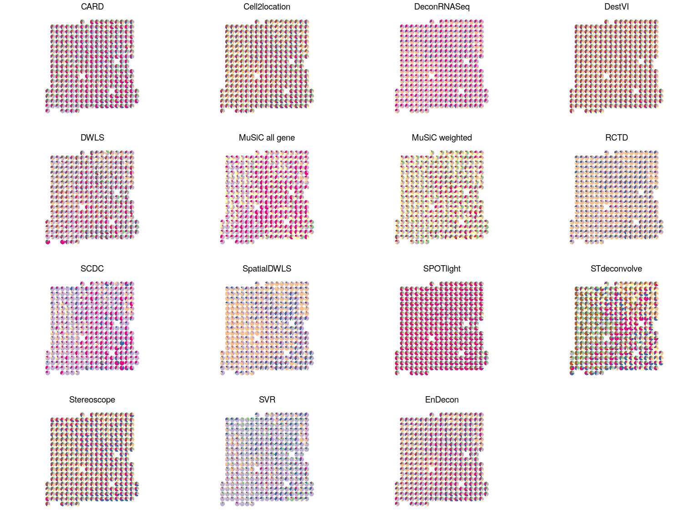
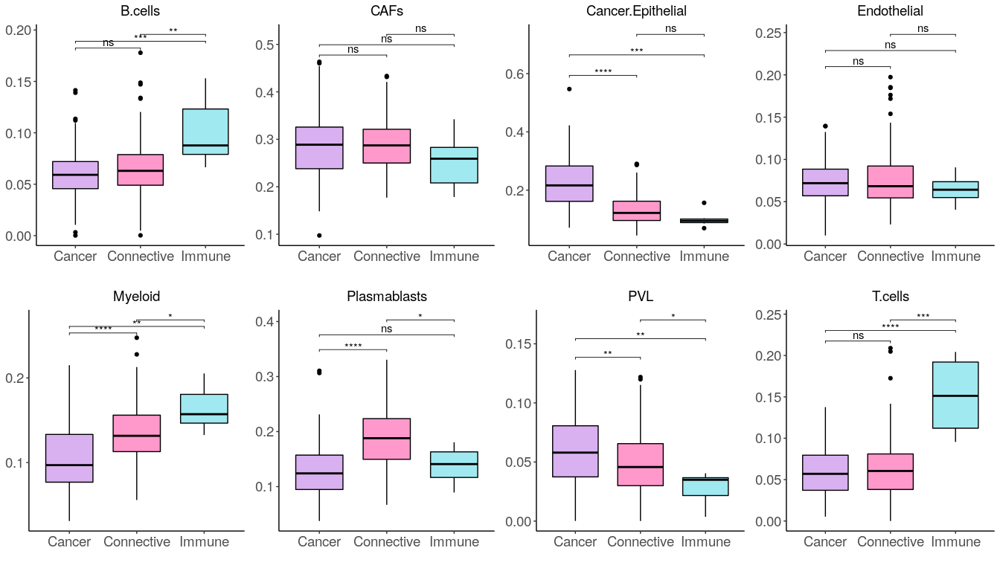
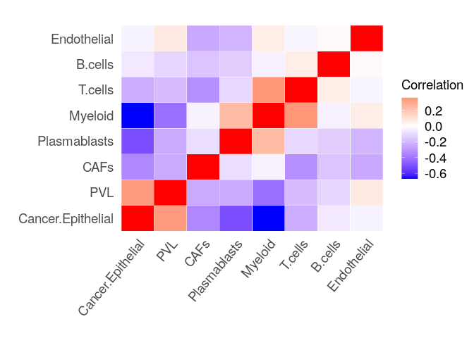
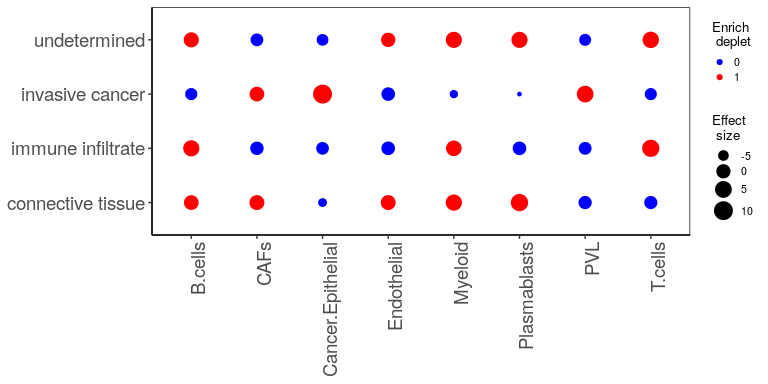

# EnDecon: Quick Start

Do you like to live in the fast lane? Do you sigh every time you see a
long vignette? Do you wish there was a TLDR on everything?

I understand.

Welcome to the EnDecon quick start!

In this vignette, you will find a **very** short guide on how to work
with EnDecon. EnDecon provides several functions and datasets for the
deconvolution of spatial transcriptomic data.

For all intents and purposes, this is a dummy data set and should only
be used to get a feel for the EnDecon package. We strongly advise you to
use real and complete data sets to fully understand the EnDecon package
and its benefits.

# Introduction

EnDecon applies ensemble learning for the deconvolution of spatial
transcriptomic data. EnDecon integrates multiple base deconvolution
results using a weighted optimization model to generate a more accurate
result.

EnDecon mainly includes two steps: (1) running each base deconvolution
method individually to obtain the base cell type deconvolution results,
and (2) integrating these base deconvolution results into a better
deconvolution result using a new proposed ensemble strategy. EnDecon
obtains the ensemble result by alternatively updating the ensemble
result as a weighted median of the base deconvolution results and the
weights of base results based on their distance from the ensemble
result.

# Loading and Pre-processing

First, let’s load the package and the data. We focus on human breast
cancer data from ST technology (Section D1 of patient D), and use breast
cancer scRNA-seq data from 10X Chromium protocol as reference. The SRT
data consists of three annotated regions (connective tissue (CT), immune
infiltrate (II) and invasive cancer (IC) regions) and one undetermined
(UN) region, annotated by a pathologist based on the morphology of the
associated H&E staining. The data are available at the \[Zenodo data
repository\] (<https://doi.org/10.5281/zenodo.4739739>). Aftet filtering
low-quality genes and cells, a final set of 11920 genes and 306 spots
for SRT data and 11920 genes and 3024 cells for scRNA-seq data are
included.

|  Cell type   | Number of cells |
|:------------:|:---------------:|
|   B cells    |       162       |
|  Epithelial  |       441       |
|   Myeloid    |       385       |
|   T cells    |      1473       |
|     CAFs     |       106       |
| Endothelial  |       210       |
| Plasmablasts |       175       |
|     PVL      |       72        |

For data process of the dataset, include reference scRNA-seq data, cell
type annotation, spatial transcriptomic data and spot location, users
could use the data_process function as following:

``` r
suppressMessages(library(EnDecon))
```

    ## Warning: replacing previous import 'RcppML::nmf' by 'NMF::nmf' when loading 'CARD'

``` r
data("breast.sc.ref")
data("breast.sc.cell.label")
data("breast.st")
data("breast.st.loc")
database <- data_process(sc_exp = breast.sc.ref, sc_label = breast.sc.cell.label,spot_exp = breast.st, spot_loc = breast.st.loc)
```

# Run base deconvolution methods

The current implementation of EnDecon combines fourteen state-of-the-
art cell type deconvolution methods (consisting of methods designed for
both bulk RNA-seq and scRNA-seq dataset): CARD, Cell2location,
DeconRNASeq, DWLS, SVR, MuSiC, RCTD, SCDC, SpatialDWLS, SPOTlight,
Stereoscope, STdeconvolve and DestVI. We summarizes the accuracy,
including PCC, RMSE and JSD, and running times of the base deconvolution
methods for simulation data in our supplementary material. Users could
run all methods or choose several methods for the ensemble learning.

``` r
# we advise user should construct the python env by anaconda and give the path to the #"python_env" parameter.
python_env <- "~/.conda/envs/EnDecon_GPU/bin/python"
Results.dec.mouse <- EnDecon_individual_methods(sc_exp = breast.sc.ref, sc_label = breast.sc.cell.label, spot_exp = breast.st, spot_loc = breast.st.loc, python_env = python_env,
use_gpu = TRUE,gene_det_in_min_cells_per = 0.01, RCTD.CELL_MIN_INSTANCE = 5, saving_results = FALSE)
```

    ## Execute CARD analysis....
    ## ## QC on scRNASeq dataset! ...
    ## ## QC on spatially-resolved dataset! ...
    ## ## create reference matrix from scRNASeq...
    ## ## Select Informative Genes! ...
    ## ## Deconvolution Starts! ...
    ## ## Deconvolution Finish! ...
    ## Run time for CARD:  0.08971302 min 
    ## Execute cell2location analysis....
    ## Run time for cell2location:  24.20904 min 
    ## Execute DeconRNASeq analysis....
    ## svd calculated PCA
    ## Importance of component(s):
    ##                  PC1     PC2     PC3     PC4     PC5     PC6     PC7     PC8
    ## R2            0.4905 0.01457 0.00526 0.00407 0.00366 0.00338 0.00333 0.00331
    ## Cumulative R2 0.4905 0.50504 0.51030 0.51437 0.51803 0.52141 0.52474 0.52805
    ## 
    ##  Attention: the number of pure cell types = 8  defined in the signature matrix;
    ## 
    ##  PCA results indicate that the number of cell types in the mixtures = 1 
    ## Run time for DeconRNASeq:  0.05421602 min 
    ## Execute DestVI analysis....
    ## Run time for DestVI:  2.649169 min 
    ## Execute DWLS and SVR analysis, the DWLS is slow and non-efficient....
    ## 
    ##  external python path provided and will be used 
    ## Consider to install these (optional) packages to run all possible Giotto commands for spatial analyses:  trendsceek SPARK multinet RTriangle FactoMiner
    ##  Giotto does not automatically install all these packages as they are not absolutely required and this reduces the number of dependencies

    ## Warning in evaluate_spatial_locations(spatial_locs = spatial_locs, cores = cores, : 
    ##  spatial locations are not given, dummy 3D data will be created

    ## Run time for DWLS:  9.041579 min 
    ## Execute MuSiC_weight and MuSiC_allgene analysis....
    ## Run time for MuSiC:  0.492098 min 
    ## Execute RCTD analysis....
    ## 
    ##           B.cells              CAFs Cancer.Epithelial       Endothelial           Myeloid 
    ##               162               106               441               210               385 
    ##      Plasmablasts               PVL           T.cells 
    ##               175                72              1473 
    ## Run time for RCTD:  1.556125 min 
    ## Execute SCDC analysis....
    ## Run time for SCDC:  0.6039044 min 
    ## Execute SpatialDWLS analysis....
    ## 
    ##  external python path provided and will be used 
    ## Consider to install these (optional) packages to run all possible Giotto commands for spatial analyses:  trendsceek SPARK multinet RTriangle FactoMiner
    ##  Giotto does not automatically install all these packages as they are not absolutely required and this reduces the number of dependenciesConsider to install these (optional) packages to run all possible Giotto commands for spatial analyses:  trendsceek SPARK multinet RTriangle FactoMiner
    ##  Giotto does not automatically install all these packages as they are not absolutely required and this reduces the number of dependenciesa custom vector of genes will be used to subset the matrix 
    ## [1] "The 707 overlapped genes between signature matrix and\nspatial expression profile"
    ## Run time for SpatialDWLS:  2.530297 min 
    ## Execute SPOTlight analysis....
    ## [1] "Preparing Gene set"
    ## [1] "Normalizing count matrix"
    ## [1] "Seeding initial matrices"
    ## [1] "Training..."
    ## [1] "Time to train NMF model was 0.98mins"
    ## [1] "Deconvoluting spots"
    ##   |                                                                                                   |                                                                                           |   0%  |                                                                                                   |=                                                                                          |   1%  |                                                                                                   |=                                                                                          |   2%  |                                                                                                   |==                                                                                         |   2%  |                                                                                                   |==                                                                                         |   3%  |                                                                                                   |===                                                                                        |   3%  |                                                                                                   |===                                                                                        |   4%  |                                                                                                   |====                                                                                       |   4%  |                                                                                                   |====                                                                                       |   5%  |                                                                                                   |=====                                                                                      |   5%  |                                                                                                   |=====                                                                                      |   6%  |                                                                                                   |======                                                                                     |   6%  |                                                                                                   |======                                                                                     |   7%  |                                                                                                   |=======                                                                                    |   7%  |                                                                                                   |=======                                                                                    |   8%  |                                                                                                   |========                                                                                   |   8%  |                                                                                                   |========                                                                                   |   9%  |                                                                                                   |=========                                                                                  |   9%  |                                                                                                   |=========                                                                                  |  10%  |                                                                                                   |==========                                                                                 |  10%  |                                                                                                   |==========                                                                                 |  11%  |                                                                                                   |===========                                                                                |  12%  |                                                                                                   |============                                                                               |  13%  |                                                                                                   |============                                                                               |  14%  |                                                                                                   |=============                                                                              |  14%  |                                                                                                   |=============                                                                              |  15%  |                                                                                                   |==============                                                                             |  15%  |                                                                                                   |==============                                                                             |  16%  |                                                                                                   |===============                                                                            |  16%  |                                                                                                   |===============                                                                            |  17%  |                                                                                                   |================                                                                           |  17%  |                                                                                                   |================                                                                           |  18%  |                                                                                                   |=================                                                                          |  18%  |                                                                                                   |=================                                                                          |  19%  |                                                                                                   |==================                                                                         |  19%  |                                                                                                   |==================                                                                         |  20%  |                                                                                                   |===================                                                                        |  21%  |                                                                                                   |====================                                                                       |  22%  |                                                                                                   |=====================                                                                      |  23%  |                                                                                                   |=====================                                                                      |  24%  |                                                                                                   |======================                                                                     |  24%  |                                                                                                   |======================                                                                     |  25%  |                                                                                                   |=======================                                                                    |  25%  |                                                                                                   |=======================                                                                    |  26%  |                                                                                                   |========================                                                                   |  26%  |                                                                                                   |========================                                                                   |  27%  |                                                                                                   |=========================                                                                  |  27%  |                                                                                                   |=========================                                                                  |  28%  |                                                                                                   |==========================                                                                 |  28%  |                                                                                                   |==========================                                                                 |  29%  |                                                                                                   |===========================                                                                |  29%  |                                                                                                   |===========================                                                                |  30%  |                                                                                                   |============================                                                               |  30%  |                                                                                                   |============================                                                               |  31%  |                                                                                                   |=============================                                                              |  31%  |                                                                                                   |=============================                                                              |  32%  |                                                                                                   |==============================                                                             |  33%  |                                                                                                   |===============================                                                            |  34%  |                                                                                                   |================================                                                           |  35%  |                                                                                                   |================================                                                           |  36%  |                                                                                                   |=================================                                                          |  36%  |                                                                                                   |=================================                                                          |  37%  |                                                                                                   |==================================                                                         |  37%  |                                                                                                   |==================================                                                         |  38%  |                                                                                                   |===================================                                                        |  38%  |                                                                                                   |===================================                                                        |  39%  |                                                                                                   |====================================                                                       |  39%  |                                                                                                   |====================================                                                       |  40%  |                                                                                                   |=====================================                                                      |  40%  |                                                                                                   |=====================================                                                      |  41%  |                                                                                                   |======================================                                                     |  42%  |                                                                                                   |=======================================                                                    |  42%  |                                                                                                   |=======================================                                                    |  43%  |                                                                                                   |========================================                                                   |  43%  |                                                                                                   |========================================                                                   |  44%  |                                                                                                   |=========================================                                                  |  45%  |                                                                                                   |==========================================                                                 |  46%  |                                                                                                   |===========================================                                                |  47%  |                                                                                                   |===========================================                                                |  48%  |                                                                                                   |============================================                                               |  48%  |                                                                                                   |============================================                                               |  49%  |                                                                                                   |=============================================                                              |  49%  |                                                                                                   |=============================================                                              |  50%  |                                                                                                   |==============================================                                             |  50%  |                                                                                                   |==============================================                                             |  51%  |                                                                                                   |===============================================                                            |  51%  |                                                                                                   |===============================================                                            |  52%  |                                                                                                   |================================================                                           |  52%  |                                                                                                   |================================================                                           |  53%  |                                                                                                   |=================================================                                          |  54%  |                                                                                                   |==================================================                                         |  55%  |                                                                                                   |===================================================                                        |  56%  |                                                                                                   |===================================================                                        |  57%  |                                                                                                   |====================================================                                       |  57%  |                                                                                                   |====================================================                                       |  58%  |                                                                                                   |=====================================================                                      |  58%  |                                                                                                   |======================================================                                     |  59%  |                                                                                                   |======================================================                                     |  60%  |                                                                                                   |=======================================================                                    |  60%  |                                                                                                   |=======================================================                                    |  61%  |                                                                                                   |========================================================                                   |  61%  |                                                                                                   |========================================================                                   |  62%  |                                                                                                   |=========================================================                                  |  62%  |                                                                                                   |=========================================================                                  |  63%  |                                                                                                   |==========================================================                                 |  63%  |                                                                                                   |==========================================================                                 |  64%  |                                                                                                   |===========================================================                                |  64%  |                                                                                                   |===========================================================                                |  65%  |                                                                                                   |============================================================                               |  66%  |                                                                                                   |=============================================================                              |  67%  |                                                                                                   |==============================================================                             |  68%  |                                                                                                   |==============================================================                             |  69%  |                                                                                                   |===============================================================                            |  69%  |                                                                                                   |===============================================================                            |  70%  |                                                                                                   |================================================================                           |  70%  |                                                                                                   |================================================================                           |  71%  |                                                                                                   |=================================================================                          |  71%  |                                                                                                   |=================================================================                          |  72%  |                                                                                                   |==================================================================                         |  72%  |                                                                                                   |==================================================================                         |  73%  |                                                                                                   |===================================================================                        |  73%  |                                                                                                   |===================================================================                        |  74%  |                                                                                                   |====================================================================                       |  74%  |                                                                                                   |====================================================================                       |  75%  |                                                                                                   |=====================================================================                      |  75%  |                                                                                                   |=====================================================================                      |  76%  |                                                                                                   |======================================================================                     |  76%  |                                                                                                   |======================================================================                     |  77%  |                                                                                                   |=======================================================================                    |  78%  |                                                                                                   |========================================================================                   |  79%  |                                                                                                   |=========================================================================                  |  80%  |                                                                                                   |=========================================================================                  |  81%  |                                                                                                   |==========================================================================                 |  81%  |                                                                                                   |==========================================================================                 |  82%  |                                                                                                   |===========================================================================                |  82%  |                                                                                                   |===========================================================================                |  83%  |                                                                                                   |============================================================================               |  83%  |                                                                                                   |============================================================================               |  84%  |                                                                                                   |=============================================================================              |  84%  |                                                                                                   |=============================================================================              |  85%  |                                                                                                   |==============================================================================             |  85%  |                                                                                                   |==============================================================================             |  86%  |                                                                                                   |===============================================================================            |  86%  |                                                                                                   |===============================================================================            |  87%  |                                                                                                   |================================================================================           |  88%  |                                                                                                   |=================================================================================          |  89%  |                                                                                                   |=================================================================================          |  90%  |                                                                                                   |==================================================================================         |  90%  |                                                                                                   |==================================================================================         |  91%  |                                                                                                   |===================================================================================        |  91%  |                                                                                                   |===================================================================================        |  92%  |                                                                                                   |====================================================================================       |  92%  |                                                                                                   |====================================================================================       |  93%  |                                                                                                   |=====================================================================================      |  93%  |                                                                                                   |=====================================================================================      |  94%  |                                                                                                   |======================================================================================     |  94%  |                                                                                                   |======================================================================================     |  95%  |                                                                                                   |=======================================================================================    |  95%  |                                                                                                   |=======================================================================================    |  96%  |                                                                                                   |========================================================================================   |  96%  |                                                                                                   |========================================================================================   |  97%  |                                                                                                   |=========================================================================================  |  97%  |                                                                                                   |=========================================================================================  |  98%  |                                                                                                   |========================================================================================== |  98%  |                                                                                                   |========================================================================================== |  99%  |                                                                                                   |===========================================================================================| 100%
    ## Run time for SPOTlight:  1.827651 min 
    ## Execute Stereoscope analysis....
    ## Run time for Stereoscope:  21.09858 min 
    ## Execute STdeconvolve analysis....

    ## Removing 23 genes present in 100% or more of pixels...

    ## 11897 genes remaining...

    ## Removing 1311 genes present in 5% or less of pixels...

    ## 10586 genes remaining...

    ## Restricting to overdispersed genes with alpha = 0.05...

    ## Calculating variance fit ...

    ## Using gam with k=5...

    ## 403 overdispersed genes ...

    ##  Using top 1000 overdispersed genes.

    ##  number of top overdispersed genes available: 403

    ## NOTE: using type='b' and comparing betas where the cell-types are
    ##             the rows (cell-types x genes)

    ## Run time for STdeconvolve:  0.280748 min

# Ensemble learning

Ensemble learning based on the base deconvolution results

``` r
pred.weight.ensemble <- Sys.time()
Results <- solve_ensemble(Results.Deconv = Results.dec.mouse[[1]], lambda = NULL, prob.quantile = 0.5)
```

    ## We will adpote a value for lambda in our algorithm... 
    ## iter:  1 loss_main:  154.3889 loss_entropy:  -2.601662 loss_all:  -287.9442 lambda:  170.0194 
    ## iter:  2 loss_main:  153.5907 loss_entropy:  -2.598977 loss_all:  -288.2859 lambda:  170.0194 
    ## iter:  3 loss_main:  153.2257 loss_entropy:  -2.597338 loss_all:  -288.3721 lambda:  170.0194 
    ## iter:  4 loss_main:  153.1561 loss_entropy:  -2.596971 loss_all:  -288.3795 lambda:  170.0194 
    ## iter:  5 loss_main:  153.1463 loss_entropy:  -2.596914 loss_all:  -288.3795 lambda:  170.0194 
    ## iter:  6 loss_main:  153.1463 loss_entropy:  -2.596914 loss_all:  -288.3795 lambda:  170.0194

``` r
end.weight.ensemble <- Sys.time()
time.weight.ensemble <- difftime(end.weight.ensemble, pred.weight.ensemble, units = "mins")
Results.dec.mouse[[1]]$EnDecon <- Results$H_norm
Results.dec.mouse[[2]] <- c(Results.dec.mouse[[2]], time.weight.ensemble)
# resort the methods 
# consistent with the picture in article
method_index <- c(1, 2, 3, 4, 5, 8, 7, 9, 10, 11, 12, 14, 13, 6, 15)
method_names <- c("CARD", "Cell2location", "DeconRNASeq", "DestVI", "DWLS", "MuSiC all gene", 
                  "MuSiC weighted", "RCTD", "SCDC", "SpatialDWLS", "SPOTlight", 
                  "STdeconvolve", "Stereoscope", "SVR", "EnDecon")
Results.dec.mouse[[1]] <- Results.dec.mouse[[1]][method_index]
names(Results.dec.mouse[[1]]) <- method_names
Results.dec.mouse[[2]] <- Results.dec.mouse[[2]][method_index]
names(Results.dec.mouse[[2]]) <- method_names
```

# Visualization

Visualization of the cell type abundance in each spots of EnDecon

``` r
library(RColorBrewer)
library(ggplot2)
library(scatterpie)
```

    ## 
    ## Attaching package: 'scatterpie'

    ## The following object is masked from 'package:sp':
    ## 
    ##     recenter

``` r
library(cowplot)
library(gridExtra)
```

    ## 
    ## Attaching package: 'gridExtra'

    ## The following object is masked from 'package:dplyr':
    ## 
    ##     combine

    ## The following object is masked from 'package:Biobase':
    ## 
    ##     combine

    ## The following object is masked from 'package:BiocGenerics':
    ## 
    ##     combine

``` r
library(viridis)
```

    ## Loading required package: viridisLite

``` r
library(ggpubr)
```

    ## 
    ## Attaching package: 'ggpubr'

    ## The following object is masked from 'package:cowplot':
    ## 
    ##     get_legend

``` r
library(rstatix)
```

    ## 
    ## Attaching package: 'rstatix'

    ## The following object is masked from 'package:stats':
    ## 
    ##     filter

``` r
EnDecon_res = Results.dec.mouse[[1]]
EnDecon = EnDecon_res$EnDecon
celltype = colnames(EnDecon)
# celltype

spot_loc = breast.st.loc
data("breast.spot.annotation")
spot_loc$region = breast.spot.annotation
spot_exp = breast.st

#setting the color
qual_col_pals = brewer.pal.info[brewer.pal.info$category == 'qual',]
col_vector  <-  unlist(mapply(brewer.pal, qual_col_pals$maxcolors, 
                              rownames(qual_col_pals)))
col_low <- "green"; col_high <- "red"

########### pie plot of EnDecon ###############
piedata_temp <- data.frame(x = spot_loc$x, y= spot_loc$y,
                           group =factor(1:length(spot_loc$x)))

pos_pie = as.data.frame(EnDecon)

piedata = cbind(piedata_temp,pos_pie)
##########
col_df <- data.frame(cell_types = celltype,
                     col_vector = col_vector[1:length(celltype)])

p1 = ggplot() + geom_scatterpie(aes(x=x, y=y, group=group),
                                cols= names(piedata)[-1:-3],
                                data = piedata,color=NA,
                                pie_scale = 1.3)+
  coord_equal() +theme_bw()+
  labs(y=" ",x=" ",title =" ")+
  theme(axis.ticks.x  = element_blank(), 
        axis.ticks.y  = element_blank(), 
        axis.text.x.bottom =element_blank(), 
        axis.text.y.left = element_blank(), 
        legend.text = element_text(size = 12,angle= 0.5), 
        legend.title = element_blank(), 
        panel.grid.major = element_blank(), 
        panel.grid.minor = element_blank(),
        panel.border = element_blank(),
        axis.line = element_blank())

p2 = p1 + scale_fill_manual(values = col_df$col_vector,
                            breaks = col_df$cell_types)
# save picture
#ggsave(p2 , file='pirchart.pdf',width = 7, height = 5) 
print(p2)
```


``` r
########### pie plot of EnDecon ###############
```

Visualization of the cell type abundance in each spots of base
deconvolution methods

``` r
########### pie plot of base deconvolution methods ###############
name_EnDecon = names(EnDecon_res)
plots =list()
for(i in 1: length(EnDecon_res)){
  
  pos_pie = as.data.frame(EnDecon_res[[i]])
  
  piedata = cbind(piedata_temp,pos_pie)
  ##########
  col_df <- data.frame(cell_types = celltype,
                       col_vector = col_vector[1:length(celltype)])
  
  plots[[i]] = ggplot() + geom_scatterpie(aes(x=x, y=y, group=group),
                                          cols= names(piedata)[-1:-3],
                                          data = piedata,color=NA,
                                          pie_scale = 1.3)+
    coord_equal() +theme_bw()+
    labs(y=" ",x=" ",title = name_EnDecon[i])+
    theme(axis.ticks.x  = element_blank(), 
          axis.ticks.y  = element_blank(), 
          axis.text.x.bottom =element_blank(), 
          axis.text.y.left = element_blank(),
          plot.title = element_text( size=14,hjust = 0.5),
          legend.position = "none",
          legend.text = element_blank(),
          legend.title = element_blank(), 
          panel.grid.major = element_blank(), 
          panel.grid.minor = element_blank(),
          panel.border = element_blank(),
          axis.line = element_blank())+ 
    scale_fill_manual(values = col_df$col_vector,
                      breaks = col_df$cell_types) 
}
pfig = plot_grid(plotlist = plots,nrow = 4)
#save picture
#ggsave(pfig , file='pirchartall_mean.pdf',width = 16, height = 12) 
print(pfig)
```



``` r
########### pie plot of base deconvolution methods ###############
```

Visualization of the comparisons of predicted cell type proportions of
EnDecon in cancer, connective and immune regions

``` r
anno_type = names(table(spot_loc[,3]))
ind_caner = which(spot_loc[,3] == anno_type[3])
ind_conn = which(spot_loc[,3] == anno_type[1])
ind_immu = which(spot_loc[,3] == anno_type[2]) 
#wilcox.test()
pval = matrix(NA, length(celltype), 3)
rownames(pval) = celltype
colnames(pval) = c("caner_conn","caner_immu","conn_immu")
plotreg = list()
for( k in 1: length(celltype)){
  # print(k)
  cell_type_prop = EnDecon[,celltype[k]]
  cancer_prop  = cell_type_prop[ind_caner]
  conn_prop = cell_type_prop[ind_conn ]
  immu_prop = cell_type_prop[ind_immu ]
  pval[k,1] = wilcox.test( cancer_prop ,conn_prop)$p.value
  pval[k,2] = wilcox.test( cancer_prop ,immu_prop )$p.value
  pval[k,3] = wilcox.test( conn_prop ,immu_prop )$p.value
  region = c("Cancer","Connective","Immune")
  reg_lable =  rep(region,c(length(cancer_prop),length(conn_prop)
                            ,length(immu_prop )))
  data_regcan = data.frame(porp = c(cancer_prop,conn_prop,immu_prop),
                           type = factor(reg_lable,
                                         levels = region ))
  # Wilcox test
  stat.test <- data_regcan %>%
    wilcox_test(porp ~ type) %>%
    add_significance()
  bxp <- ggboxplot(data_regcan, x = "type", y = "porp", fill = "type", 
                   palette = c("#d9b1f0", "#FF99CC", "#a1e9f0"))+
    theme_classic()+
    labs(y="",x=" ",title = celltype[k])+
    theme(
      axis.text.x.bottom = element_text(size = 14,hjust = 0.5,angle = 0), 
      axis.text.y.left = element_text(size = 14),
      axis.title.x = element_text(size = 14,hjust = 0.5), 
      axis.title.y = element_blank(),#element_text(size = 14),
      plot.title = element_text( size=14,hjust = 0.5),
      legend.title = element_blank(), 
      legend.position = "none",
      panel.grid.major = element_blank(), 
      panel.grid.minor = element_blank(),
      panel.border = element_blank(),
      axis.line = element_line(colour = "black")
    )
  # Box plot
  stat.test <- stat.test %>% add_xy_position(x = "type")
  plotreg [[k]]  = bxp + stat_pvalue_manual(stat.test, label = "p.adj.signif", 
                                            tip.length = 0.01)
}

plotregio = plot_grid(plotlist = plotreg,nrow = 2)
print(plotregio)
```



``` r
# save picture
#ggsave(plotregio , file='plotregio.pdf',width = 14, height =8) 
# save p-value
#write.table(pval,"postion_pval.txt",sep="\t",row.names= TRUE,col.names = #FALSE,
#            quote = FALSE)
```

Visualization of the predicted cell type proportion colocalization of
EnDecon.

``` r
corr_par = matrix(NA, ncol(EnDecon ), ncol(EnDecon ))
colnames(corr_par) = rownames(corr_par) = colnames(EnDecon )
for(i in 1 : ncol(EnDecon )){
  for(j in 1 : ncol(EnDecon )){
    corr_par [i,j] = cor( EnDecon  [,i],  EnDecon  [,j])
  }
}
hmat = corr_par
aa = heatmap(corr_par)
```


``` r
y <- colnames(hmat)[aa$rowInd]
x <- colnames(hmat)[aa$colInd]
jac_heat<- expand.grid(X=x, Y=y)
jacr_lower = hmat[aa$rowInd,aa$colInd]
diag(jacr_lower) = NA
jac_heat$Z <- as.vector(jacr_lower)
heat_two = ggplot(jac_heat, aes(factor(X), factor(Y), fill= Z)) +  
  geom_tile(color = "white")+
  scale_fill_gradient2(low = "blue", high = "red", mid = "white", 
                       midpoint = 0, limit = c(min(na.omit(jac_heat$Z)), max(na.omit(jac_heat$Z))),
                       space = "Lab",
                       na.value = "red",
                       name="Correlation") +
  theme_bw()+
  labs(y=" ",x=" ",title =" ")+
  theme(axis.ticks.x  = element_blank(), 
        axis.ticks.y  = element_blank(), 
        axis.text.x.bottom = element_text(size = 14,hjust = 1,angle = 50), 
        axis.text.y.left = element_text(size = 14),
        legend.text = element_text(size = 14,angle= 0.5), 
        legend.title = element_text(size = 14), #element_blank(),  #element_text(size = 14),
        panel.grid.major = element_blank(), 
        panel.grid.minor = element_blank(),
        panel.border = element_blank(),
        axis.line = element_blank())
heat_two
```



``` r
#save picture
#ggsave(heat_two , file='celltypecorr.pdf',width = 10, height = 8) 
```

Visualization of the enrichment of predicted cell type proportion from
EnDecon in each spots.

``` r
# function for the enrichment
enrich_prop = function (spot_loc, EnDecon, n){
  library(abind)
  npots = nrow(spot_loc)
  celltype = colnames(EnDecon)
  region_real = spot_loc$region 
  region = names(table(region_real))
  num_region = length(region)
  num_celltype = length(celltype)
  ####### the ground truth of the cell type proportion
  true_prop_region = matrix(NA,num_celltype,num_region)
  colnames(true_prop_region) = region
  rownames(true_prop_region) = celltype
  ind_region =matrix(list(),num_region,1)
  names(ind_region) = region
  for(i in 1:num_region){
    ind_sub = which(region_real==region[i])
    ind_region[[i]] = ind_sub
    prop_sub = EnDecon[ind_sub,]
    true_prop_region[,i] = apply(prop_sub,2,mean)
  }
  ################ the permutaion
  shift_prop_region = matrix(NA,num_celltype,num_region)
  colnames(shift_prop_region) = region
  rownames(shift_prop_region) = celltype
  shift_prop_region_diff = list()
  for(j in 1:n) {
    ind_loc_permute <- sample(1:npots, npots)
    spot_prop_shift = EnDecon[ind_loc_permute,]
    for(k in 1:num_region){
      prop_shift = spot_prop_shift[ind_region[[k]] ,]
      shift_prop_region[,k] = apply(prop_shift,2,mean)
    }
    shift_prop_region_diff[[j]] = true_prop_region-shift_prop_region
  }
  ######### mean and the standard deviation of the difference
  mean_diff_temp = do.call(abind,c(shift_prop_region_diff,list(along=3)))
  mean_diff = apply(mean_diff_temp,1:2,mean)
  sd_diff =  apply(mean_diff_temp,1:2,sd)
  enrich_diff = mean_diff /sd_diff
  return(enrich_diff)
}
enrich_res_temp = enrich_prop(spot_loc, EnDecon, 10000)
enrich_res = t(enrich_res_temp)
ind_adj = which(enrich_res>0)
enrich_res_adj = enrich_res
enrich_res_adj[ind_adj] =1
enrich_res_adj[-ind_adj] =0
########the bubble plot
# the wilcox test
xs1 = rep(colnames(enrich_res),each=length(rownames(enrich_res)))
ys1 = rep(rownames(enrich_res),length(colnames(enrich_res)))
data = data.frame( x = factor(xs1,levels = colnames(enrich_res)), 
                   y= factor(ys1,levels = rownames(enrich_res)), 
                   Ratio = as.vector(enrich_res), 
                   Overlap = as.vector(enrich_res_adj) )
jac_plot = ggplot(data = data, mapping = aes(x = x, y = y,color = Overlap )) +
  geom_point(aes(size =  Ratio,color = factor(Overlap)),)+
  labs(y="",x="",color = "Enrich \n deplet",size= "Effect \n size")+
  theme_bw()+ 
  scale_color_manual(values=c( "blue","red"))+
  theme(
    axis.text.x.bottom = element_text(size = 14,hjust = 1,angle = 90), 
    axis.text.y.left = element_text(size = 14),
    axis.title.x = element_blank(), 
    axis.title.y = element_blank(),
    plot.title = element_text( size=14,hjust = 0.5), 
    legend.text = element_text(size = 8), 
    legend.title = element_text(size = 10),
    legend.key.width=unit(0.4,"cm"),
    legend.key.height=unit(0.4,"cm"),
    panel.grid.major = element_blank(), 
    panel.grid.minor = element_blank(),
    axis.line = element_line(colour = "black"),
    panel.border = element_rect(fill= NULL, color="black", size=0.5, linetype="solid")
    
  )
jac_plot
```



``` r
#save picture
#ggsave(jac_plot, file='./figure/jac_plot.pdf',width = 8, height = 4) 
```
